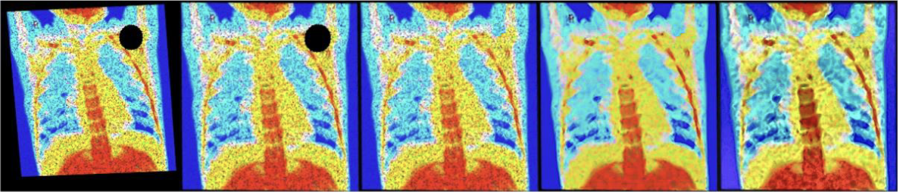

# X-Ray Image Processing Coursework



*Figure 1 - image processing pipeline. From left to right: original image, perspective warping, inpainting, noise filtering, colour and contrast adjustment*

This repo implements exemplar-based inpainting (Criminisi 2004) on chest x-ray images using OpenCV and NumPy. A small classifier demo and a sample dataset are included under `image_processing_files/`.

> Project received 67% (2:1 classification)

## Project structure

- `main.py` — runs the inpainting pipeline over a folder of images.
- `criminisi_inpainter.py` — core Criminisi inpainting implementation (OpenCV-based).
- `Results/` — output folder for processed images (auto-created if missing).
- `image_processing_files/` — sample test assets:
  - `xray_images/` — 100 sample images (first 50 healthy, next 50 pneumonia).
  - `classify.py` — optional classifier demo using OpenCV DNN.
  - `classifier.model` — ONNX weights for the classifier demo.

## Installation

This project uses `uv` for dependency management. First, install `uv` if you don't have it:

```bash
curl -LsSf https://astral.sh/uv/install.sh | sh
```

Then sync the dependencies:

```bash
uv sync
```

## Usage Guide

By default, the images inside `image_processing_files/xray_images` are processed. To specify a different directory of images, from the project root run:

```bash
python3 main.py <path_to_images>
```

Output images are written to `Results/` with the same filenames as inputs.

- Performance: inpainting is patch-based and can be slow on large images. Consider downscaling inputs or reducing `patch_size` for quicker runs.

## Optional: classification demo

There’s a simple classifier example you can run on the sample images using the included ONNX model and OpenCV’s DNN module:

```bash
python3 image_processing_files/classify.py --data image_processing_files/xray_images --model image_processing_files/classifier.model
```

It will print a predicted label per image and a final accuracy (first 50 images are labelled healthy, next 50 pneumonia).

### Runtime options

- Start partway through a directory: set the `start_from` variable near the bottom of `nb_main.py` to the desired starting filename (e.g., "im044-healthy.jpg"). Set to `None` to process all files.
- Inpainter options (see `criminisi_inpainter.py` constructor):
  - `patch_size` (default 9)
  - `verbose=True|False` — print timing/progress for inpainting.
  - `show_progress=True|False` — save intermediate working images into `Results/` each iteration.

## References

[1] A. Criminisi, P. Pérez and K. Toyama, "Region filling and object removal by exemplar-based image inpainting," IEEE Transactions on Image Processing, vol. 13, no. 9, pp. 1200-1212, 2004.

[2] I. C. Moura, "inpaint-object-remover" (2021). <https://github.com/igorcmoura/inpaint-object-remover> (commit dc535f2).