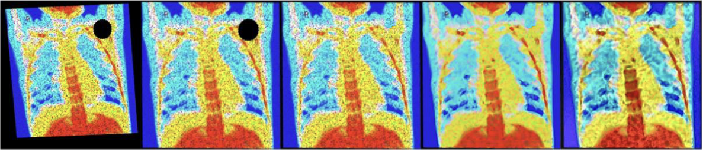

# X-Ray Image Processing Coursework



*Figure 1 - image processing pipeline. From left to right: original image, perspective warping, inpainting, noise filtering, colour and contrast adjustment*

This repo implements exemplar-based inpainting (Criminisi 2004) on chest x-ray images using OpenCV and NumPy. A small classifier demo and a sample dataset are included under `image_processing_files/`.

## Feedback
Project received **67/100** (2:1 classification)
1) Accuracy 92% - 16/20
2) Visual quality - 14/20. Categories:
  - −2 pts: Though noise removal has been done to some extent, the images still contain some noise.
  - −4 pts: Significant amounts of unwanted artefacts have been introduced as part of the processing applied to the images.
  - -0 pts: The contrast, brightness and the colours are visually plausible.
  - -0 pts: The images have been successfully dewarped, as visually judged by a human observer.
3) Code quality - 5/5
  - Code is sufficiently commented / documented.
  - The code is structured well and it is clear how different tasks are performed.
4) Report - 20/30
  - -0 pts: The report outlines and describes the proposed solution.
  - -3 pts: The report is not structured very clearly. There are no sections and subsections and this makes following the report a bit difficult.
  - -7 pts: The analysis of the results is not thorough enough. Including numerical evaluations and analyses in the form of tables, diagrams, histograms, etc. would have improved the quality of the report.
5) Advanced credit - 10/20
  - Credit given for the use of contours.
  - Credit given for the way inpainting part of the solution is handled.


## Project structure

- `scripts/`
  - `main.py` — runs the inpainting pipeline over a folder of images.
  - `classify.py` — optional classifier demo using OpenCV DNN.
- `src/`
  - `criminisi_inpainter.py` — core Criminisi inpainting implementation (OpenCV-based).
- `models/` — classifier model
  - `classifier.model` — ONNX weights for the classifier demo.
- `xray_images/` — 100 sample images (first 50 healthy, next 50 pneumonia).
- `results/` — output folder for processed images (auto-created if missing).

## Installation

This project uses `uv` for dependency management. First, install `uv` if you don't have it:

```bash
curl -LsSf https://astral.sh/uv/install.sh | sh
```

Then sync the dependencies:

```bash
uv sync
```

## Usage Guide

**Quick start**
```bash
python3 scripts/main.py
```

By default, the images inside `xray_images` are processed. To specify a different directory of images, from the project root run:

```bash
python3 scripts/main.py <path_to_images>
```

Output images are written to `results/` with the same filenames as inputs.

- Performance: inpainting is patch-based and can be slow on large images. Consider downscaling inputs or reducing `patch_size` for quicker runs.

## Optional: classification demo

There’s a simple classifier example you can run on the sample images using the included ONNX model and OpenCV’s DNN module:

```bash
python3 scripts/classify.py --data best_results
```

It will print a predicted label per image and a final accuracy (first 50 images are labelled healthy, next 50 pneumonia).

### Runtime options

- Start partway through a directory: set the `start_from` variable near the bottom of `scripts/main.py` to the desired starting filename (e.g., "im044-healthy.jpg"). Set to `None` to process all files.
- Inpainter options (see `criminisi_inpainter.py` constructor):
  - `patch_size` (default 9)
  - `verbose=True|False` — print timing/progress for inpainting.
  - `show_progress=True|False` — save intermediate working images into `results/` each iteration.

## References

[1] A. Criminisi, P. Pérez and K. Toyama, "Region filling and object removal by exemplar-based image inpainting," IEEE Transactions on Image Processing, vol. 13, no. 9, pp. 1200-1212, 2004.

[2] I. C. Moura, "inpaint-object-remover" (2021). <https://github.com/igorcmoura/inpaint-object-remover> (commit dc535f2).